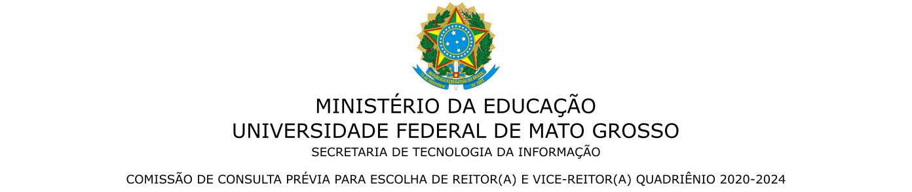
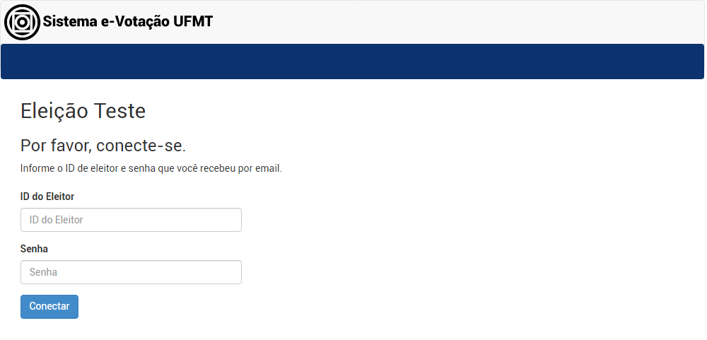
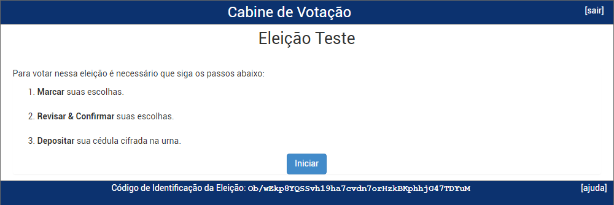
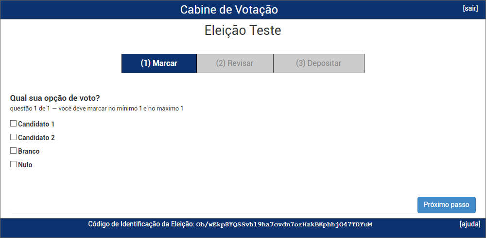
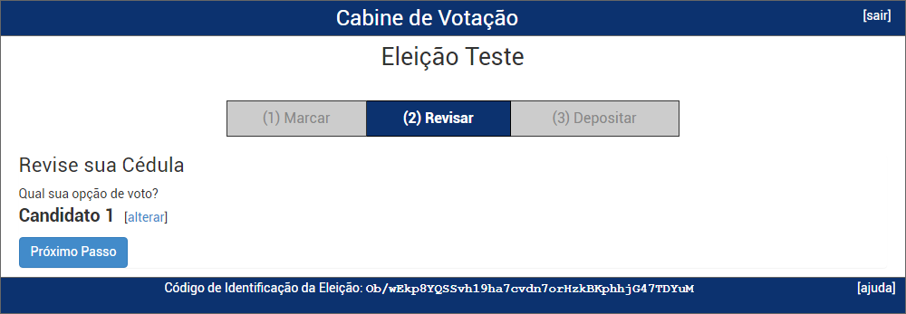
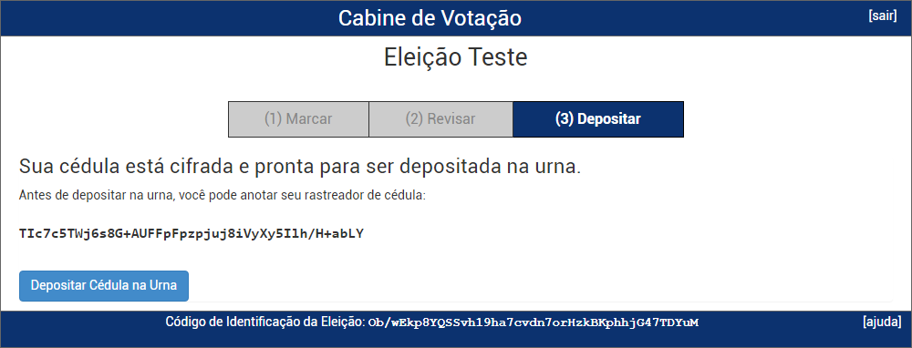
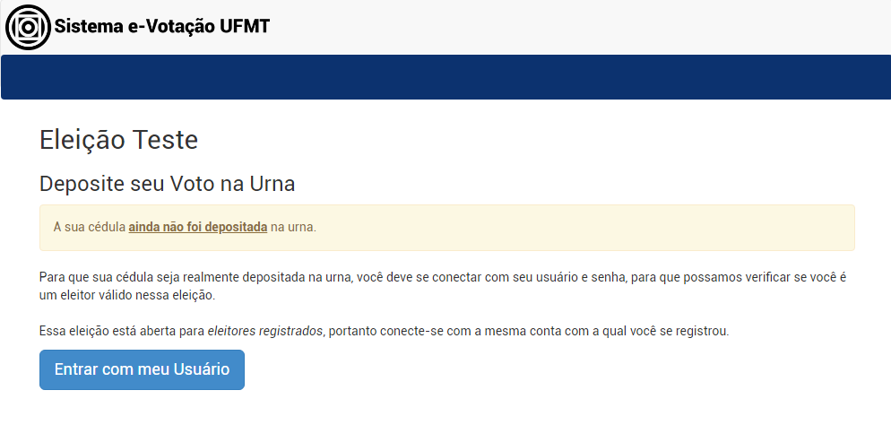
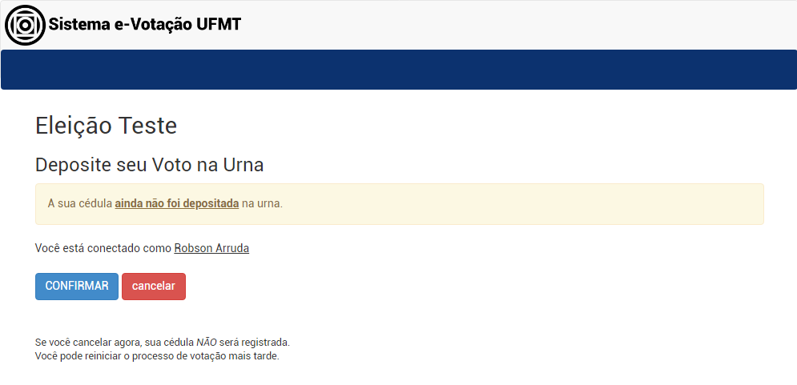
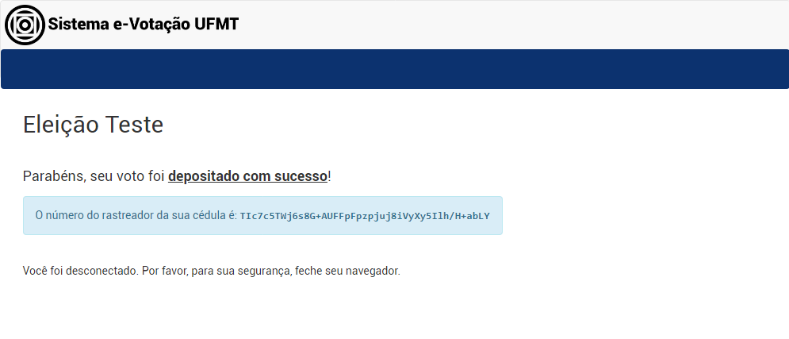

---

# Como votar usando o Sistema e-Votação da UFMT

Se você for um estudante ativo de graduação presencial, estudante de pós graduação stricto sensu presencial ou servidor da UFMT (técnico ou docente) ativo ou aposentado, você deverá acessar o Sistema de e-Votação da UFMT com o seu CPF e a senha do Portal de Sistemas Integrados. Com o seu CPF e senha em mãos, basta iniciar o processo de votação a partir da etapa 2.

**SERVIDORES APOSENTADOS:** Certifique-se de que você tenha acesso ao Portal de Sistemas da UFMT com o seu **CPF**. Caso não tenha acesso, [clique aqui](aposentado.md) e siga as instruções.

Se você for um estudante ativo de EaD ou estudante lato sensu (presencial ou à distância), você deverá receber por e-mail uma senha para acessar o Sistema e-Votação da UFMT. Com o seu CPF e senha em mãos, basta iniciar o processo de votaçaõ a partir da etapa 1 **e ignorar a etapa 6**.

## Etapas da votação

1. **Se você recebeu por e-mail o endereço de votação e uma senha**, basta utilizar seu CPF e essa senha para entrar no sistema de votação.

    - Se você vai votar como estudante ativo de graduação presencial, estudante de pós graduação stricto sensu presencial ou servidor da UFMT (técnico ou docente) ativo ou aposentado, ignore essa etapa.

    

1. Logo na página inicial você terá as instruções básicas. Clique no botão **Iniciar**

    

1. Escolha um dos candidatos e clique no botão **Próximo passo**.

    

1. Nesta etapa é possível revisar as escolhas de voto e caso esteja tudo correto clique no botão **Próximo passo**.

    - Se desejar alterar o voto, basta clicar no link **[alterar]** e a tela retornará para a cédula de votação com todos os candidatos disponíveis para nova escolha. Antes de escolher a nova opção de voto, você deve clicar na opção anteriormente marcada para desmarcá-la.

    

1. Clique no botão **Depositar Cédula na Urna**. Somente ao depositar a cédula na urna eletrônica o voto será contabilizado para a referida eleição.

    

1. Você deverá fazer a autenticação informando o seu CPF e senha utilizados para acessar o [Portal de Sistemas Integrados](https://sistemas.ufmt.br/ufmt.portalsistemas).Clique no botão **Entrar com meu Usuário** para iniciar esse procedimento de autenticação. Se você não lembra sua senha, acesse o Portal de Sistemas Integrados e clique em Recuperar senha.

    - Se você vai votar como estudante ativo de EaD ou estudante lato sensu (presencial ou à distância), ignore essa etapa.

    

1. Clique no botão **Confirmar** para depositar sua cédula na urna. Se não deseja depositar a cédula, clique no botão cancelar.

    

1. Parabéns, seu voto foi depositado com sucesso.

    

**Atenção:** O Sistema e-Votação da UFMT permite que você deposite cédulas na urna quantas vezes desejar. Como estamos tratando de uma eleição online, o eleitor não vai a um local específico e de acesso restrito para votar, logo pode estar acompanhado de outras pessoas ou observadores. Esta funcionalidade da solução Helios Voting é para mitigar os riscos de coerção, permitindo que o eleitor possa alterar o seu voto posteriormente, caso tenha sido pressionado a uma escolha anterior. Por ser uma característica nativa do sistema Helios Voting, diversas instituições que utilizam o sistema mantém esta funcionalidade ativada em suas eleições e a STI/UFMT optou em manter para não alterar o código original do sistema.

Portanto, esclarecemos que na UFMT todos os eleitores poderão votar quantas vezes quiserem, porém, apenas o último voto será utilizado na apuração, sendo todos os demais votos descartados. Destacamos que cada eleitor continua tendo direito a apenas um único voto, o que pode ser confirmado pelo próprio eleitor por meio do rastreador de cédula, que é gerado de forma única para cada voto e enviado para o email do votante.
